## Introduction to ArcGIS Online  
...a step-by-step tutorial to accompany the workshop  

---

### Section One: Signing in  

If you are an organization affiliate (i.e. a member of the Brock University community) follow these steps:  

1. Go to [arcgis.com](https://arcgis.com)    
2. Click **Sign in** 
3. Click **Your ArcGIS Organization's URL**  
4. Complete the URL by entering the text **brock**  

    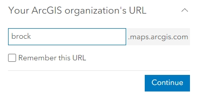  

5. Click **Continue**
6. Click **BROCK UNIVERSITY**    
7. This action should direct you to the Brock University authentication page. Enter your Brock credentials and click **Sign in**.  

    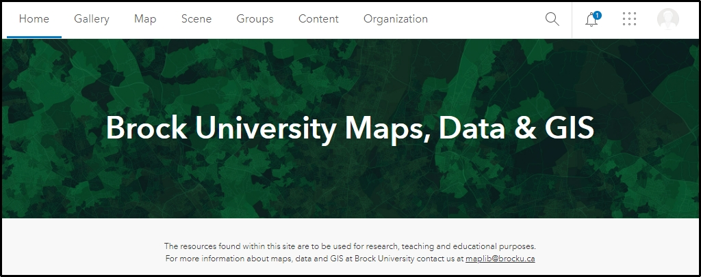  
    
---

### Section Two: The Interface  

1. From the menus at the top, click **Map**. This action opens the default map viewer and should look like this:  

    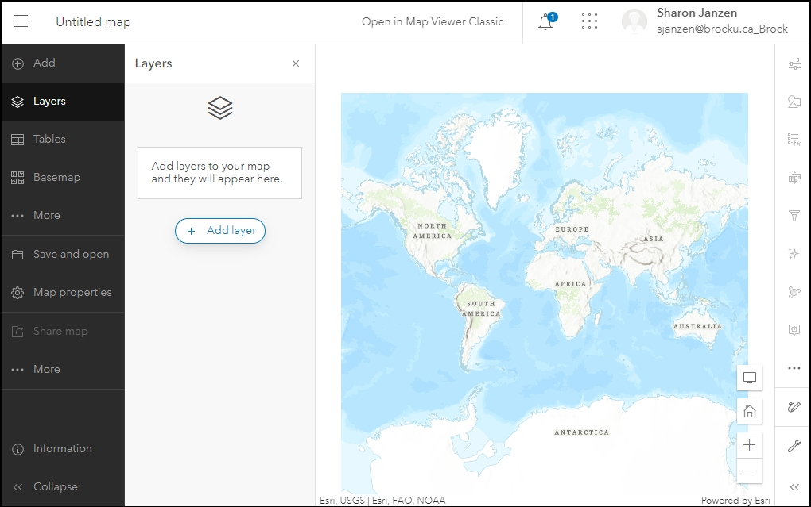  
    
**NOTE: If the default viewer does not look like the above screenshot, you may have to click 'Open in new map viewer' at the top right.**

The New Map Viewer is composed of a dark toolbar on the left and a light toolbar on the right. Depending on the tool you have selected, various panels will appear.  

At the bottom of each toolbar there is a 'collapse/expand' button 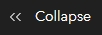. 

2. Click these buttons to collapse or expand the menus.  
3. Click the 'hide/show interface' button  to collapse all menus and panels at once.  
4. To search for a location, click Map Tools 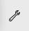 from the right menu and click Search. Type in a place or address and make a selection from the results. 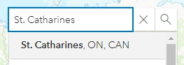 The map zooms to the location.  
5. Use the mouse scroll wheel or the zoom tools to pan and zoom on the map.

    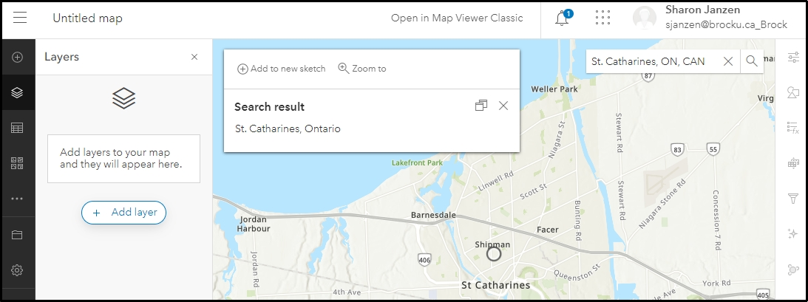  
    
6. The map viewer provides ready-made basemaps to choose from. Click the basemap button 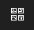 on the left and explore the options. Before continuing, select the *Light Gray Canvas* option.  
7. At the top of the Basemap listing options, click **Current basemap >**
    
8. Click the eyeball icon to turn off the *Light Gray Reference* layer . This action turns off the placename labels.

    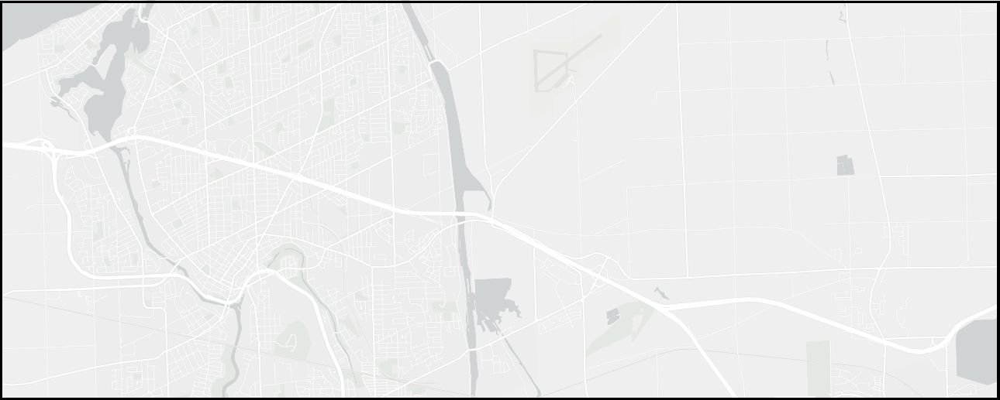  
    
9. To save your map, click the save > save as button 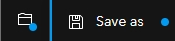  
10. Enter a unique map name that does not include special characters. Click save. All of your work is saved in the cloud making it accessible from any device with internet connection.  

---

### Section Three: Layers & Symbology

There are a variety of ways to add data to your map. This tutorial will describe adding layers from within ArcGIS Online. 

1. Click the layers button 
2. Click 
3. Click the dropdown beside **My Content** and select **ArcGIS Online**. This action will allow you to search all of ArcGIS Online for data layers. For the purposes of this tutorial, 2 layers have been created representing Laura Secord's walking route and the destinations of each of the 5 phases.  
4. Enter the search term **Secord walking route**.
5. Look for the results that match this image: 
6. Click the small plus sign to add each layer to the map. You should have 2 layers: "Secord Walking Route" and "Secord Walking Destinations".
7. Click the back arrow beside **Add layer** at the top left of the panel. 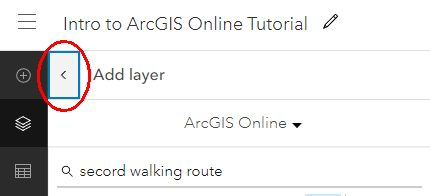  
    
      
    
8. If necessary, drag and drop the layers such that the 'destinations' layer is on top of the 'route' layer.
9. A layer is selected when there is a vertical blue bar along the side. With the 'Destinations' layer selected, click **Edit layer style** from the right side panel.
10. From the **Styles** panel, under step 2, click **Style options** below **Pick a style**.
11. Click the symbol below **Symbol style**.
12. Click the dropdown for **Basic shapes** and select **Pins**.
13. Select a pushpin and increase the size to 30.  
14. Click the X at the top of the **Symbol style** panel and click Done twice.
15. 

