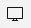

## Introduction to ArcGIS Online  
...a step-by-step tutorial to accompany the workshop  

---

### Section One: Signing in  

If you are an organization affiliate (i.e. a member of the Brock University community) follow these steps:  

1. Go to [arcgis.com](https://arcgis.com)    
2. Click **Sign in** 
3. Click **Your ArcGIS Organization's URL**  
4. Complete the URL by entering the text **brock**  

      

5. Click **Continue**
6. Click **BROCK UNIVERSITY**    
7. This action should direct you to the Brock University authentication page. Enter your Brock credentials and click **Sign in**.  

      
    
---

### Section Two: The Interface  

1. From the menus at the top, click **Map**. This action opens the default map viewer and should look like this:  

      
    
**NOTE: If the default viewer does not look like the above screenshot, you may have to click 'Open in new map viewer' at the top right.**

The New Map Viewer is composed of a dark toolbar on the left and a light toolbar on the right. Depending on the tool you have selected, various panels will appear.  

At the bottom of each toolbar there is a 'collapse/expand' button .  
2. Click these buttons to collapse or expand the menus.  
3. Click the 'hide/show interface' button  to collapse all menus and panels at once.

